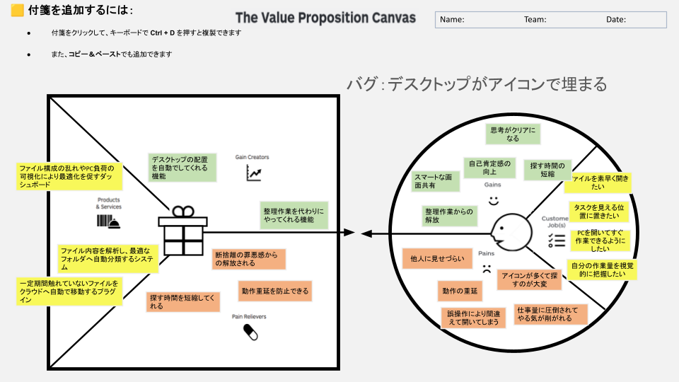

# VPC v1 - tec2562

> 「**自分や周りの人を顧客に設定**」したVPC。13週後の自分が欲しいもの・身近な人のために作りたいものを設計する。
> v1 でいい。完璧を目指さない。第6回でアップデート(v2)します。

---

## 1. 解決したい困りごとを 1つ 選ぶ

> [`bug-list.md`](./bug-list.md) の20個から、**「自分が一番これを解決したい!」と思うもの** を1つ選んでください。
> 1つに絞れなければ、複数候補を書いてOK(後で絞り込みます)。

**選んだ困りごと**:

14. デスクトップがアイコンで埋め尽くされている。

---

## 2. その解決策のアイデアを書く

> 選んだ困りごとに対する「**こうだったらいいのに**」を1つ書く。
> 現実性は気にせず、自由に発想。

**解決のアイデア**:

ファイルを自動で整理・分類してくれるダッシュボードやプラグイン

---

## 3. VPC本体

> 上で選んだ「困りごと」と「解決のアイデア」を起点に、6要素を埋めていきます。

### 🟦 Customer Profile(顧客=自分自身)

#### Jobs(やりたいこと・動詞で書く)

- ファイルを素早く開きたい
- タスクを見える位置に置きたい
- PCを開いてすぐ作業できるようにしたい
- 自分の作業量を視覚的に把握したい

#### Pains(困っていること)

- 他人に見せづらい
- 動作の重延
- 誤操作により間違えて開いてしまう
- アイコンが多くて探すのが大変
- 仕事量に圧倒されてやる気が削がれる

#### Gains(得たい未来・状態)

- 思考がクリアになる
- 自己肯定感の向上
- 探す時間の短縮
- スマートな画面共有
- 整理作業からの解放

---

### 🟧 Value Map(あなたが作るもの)

#### Products & Services

- ファイル構成の乱れやPC負荷の可視化により最適化を促すダッシュボード
- ファイル内容を解析し最適なフォルダへ自動分類するシステム
- 一定期間触れていないファイルをクラウドへ自動で移動するプラグイン

#### Pain Relievers

- 断捨離の罪悪感からの解放される
- 探す時間を短縮してくれる
- 動作重延を防止できる

#### Gain Creators

- デスクトップの配置を自動でしてくれる機能
- 整理作業を代わりにやってくれる機能

---

## 4. Fit確認(整合チェック)

| Pains/Gains | ↔ | Pain Relievers / Gain Creators | チェック |
|---|---|---|---|
| Pain ① | ↔ | Pain Reliever ① | ✓ / ✗ |
| Pain ② | ↔ | Pain Reliever ② | ✓ / ✗ |
| Pain ③ | ↔ | Pain Reliever ③ | ✓ / ✗ |
| Gain ① | ↔ | Gain Creator ① | ✓ / ✗ |
| Gain ② | ↔ | Gain Creator ② | ✓ / ✗ |

> 整合しないものは「自分が作りたいだけ」のプロダクトになりがち。
> 迷ったら AI大学講師に壁打ち。
